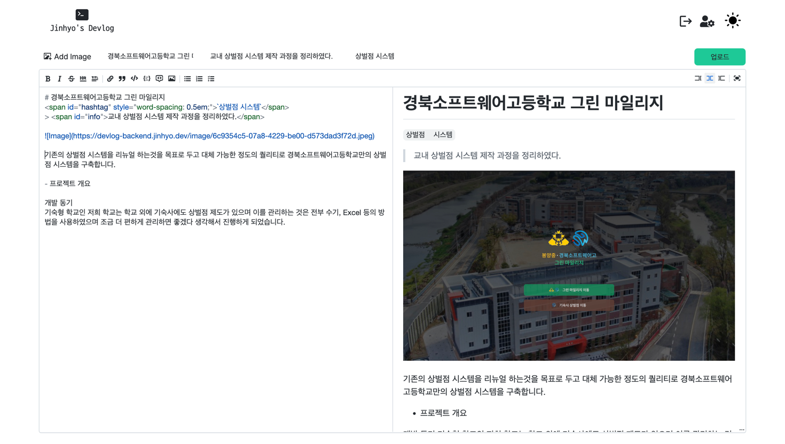
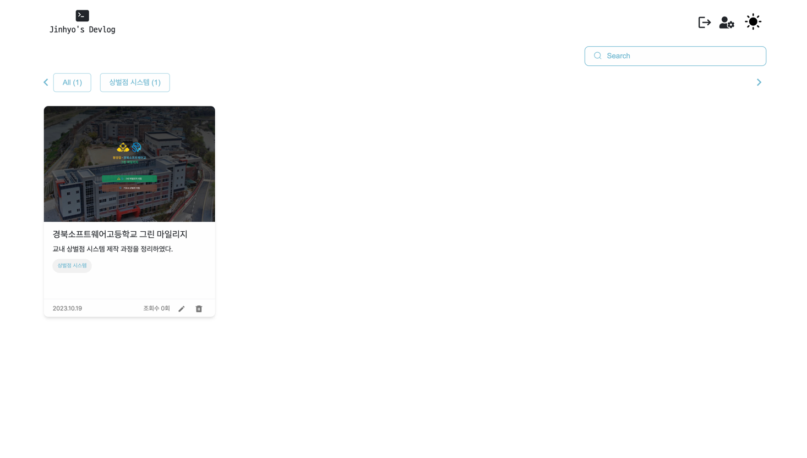
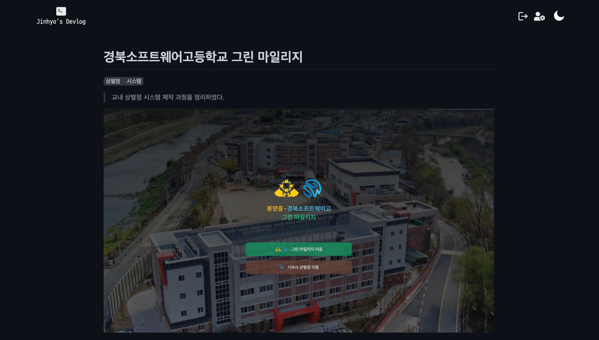

# Jinhyo's Devlog (personal project)

- Project link <a target="_blank">https://devlog.jinhyo.dev</a>
- Repository Link <a target="_blank">https://github.com/jinhyo-dev/devlog-front</a>

## 프로젝트 주제 및 선정배경

[velog.io]('https://velog.io') 와 같은 개발 블로그 페이지를 보고, 직접 개발 블로그 사이트를 만들어보고싶어 제작하게 되었다.

## 개발 및 수행 목표

나만의 개발 블로그를 만들어 게시글을 올리며 사용자와 공유한다.

## 사용기술

## 프로젝트 레이아웃 소개

